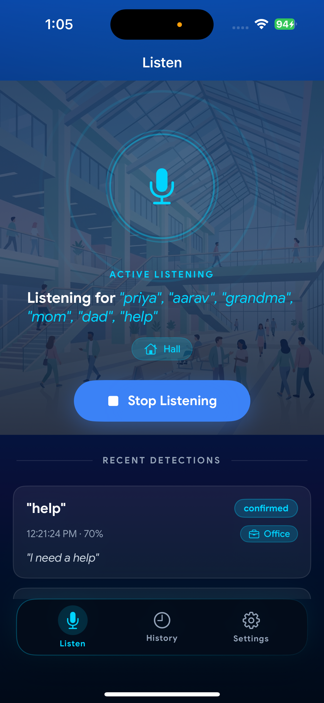
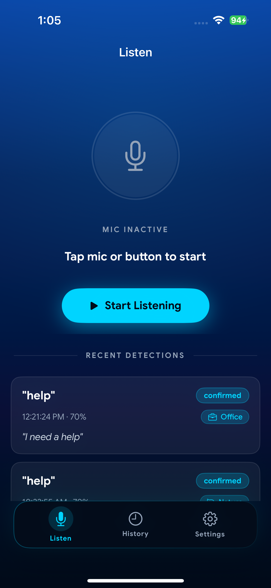

# FocusAid

A native iOS app that listens locally for user-configured trigger words and alerts the user with a haptic cue when their name — or any word they care about — is spoken nearby. Built entirely in **Swift / SwiftUI** with on-device audio processing; no audio ever leaves the device.

---

## Screenshots

| Active Listening | Mic Inactive |
|:---:|:---:|
|  |  |

> *Listen tab showing active keyword detection with acoustic scene badge (Hall) and a recent detection card confirming "help" at 70% confidence.*

---

## Features

- **Always-on keyword spotting** — listens for multiple trigger words simultaneously (e.g. "grandma", "mom", "dad", "help")
- **Acoustic scene classification** — YAMNet TFLite model detects the ambient environment (Hall, Office, Restaurant, etc.) and tags each detection
- **Voice Activity Detection (VAD)** — custom VAD engine avoids processing silence, reducing CPU usage
- **On-device speech transcription** — Apple's `SFSpeechRecognizer` transcribes a short clip after each keyword hit for confirmation
- **Confidence-based confirmation** — each detection is marked `confirmed` or `unconfirmed` based on transcription match + confidence score
- **Detection history** — all events persisted locally with timestamp, transcript, confidence, and scene
- **Three-tab UI** — Listen · History · Settings

---

## Tech Stack

| Layer | Technology |
|---|---|
| Language | Swift 5.0 |
| UI Framework | SwiftUI |
| Audio capture | AVFoundation (`AVAudioEngine`) |
| Keyword detection | Custom VAD + pattern matching on PCM frames |
| Scene classification | YAMNet via TensorFlow Lite (`TensorFlowLiteSwift ~> 2.14.0`) |
| Speech transcription | `Speech` framework (`SFSpeechRecognizer`) |
| Persistence | `UserDefaults` + `Codable` models |
| Dependency manager | CocoaPods |
| Min iOS target | iOS 17.6 |

---

## Project Structure

```text
ios/
├── FocusAid.xcworkspace          ← open this in Xcode
├── FocusAid.xcodeproj/
│   └── project.pbxproj
├── FocusAid/
│   ├── AppDelegate.h / .mm       ← app entry point (ObjC bridge)
│   ├── main.m
│   ├── Info.plist
│   ├── PrivacyInfo.xcprivacy
│   ├── LaunchScreen.storyboard
│   ├── Images.xcassets/          ← app icon, splash, scene images
│   ├── Fonts/                    ← Google Sans (Regular, Medium, Bold, Italic)
│   └── HearingTriggerSwift/
│       ├── HearingTriggerApp.swift       ← SwiftUI @main entry
│       ├── Data/
│       │   ├── DetectionRecord.swift     ← Codable detection model
│       │   └── SettingsStore.swift       ← ObservableObject for trigger words + prefs
│       ├── Services/
│       │   ├── HearingManager.swift      ← core audio session + keyword orchestration
│       │   ├── VADEngine.swift           ← voice activity detection
│       │   ├── SpeechTranscriber.swift   ← SFSpeechRecognizer wrapper
│       │   └── AcousticSceneDetector.swift  ← YAMNet TFLite inference
│       └── UI/
│           ├── HomeView.swift            ← Listen tab
│           ├── HistoryView.swift         ← History tab
│           ├── SettingsView.swift        ← Settings tab
│           ├── MainTabView.swift         ← TabView container
│           ├── SplashScreenView.swift    ← launch animation
│           ├── PermissionGateView.swift  ← mic + speech permission prompt
│           ├── Colors.swift              ← design tokens
│           ├── FontHelper.swift          ← Google Sans registration
│           └── Components/
│               ├── PulseRingView.swift       ← animated mic ring
│               └── DetectionCardView.swift   ← detection history card
├── FocusAidTests/
│   └── HearingTriggerRNTests.m
├── Podfile
├── Podfile.lock
└── models/                       ← YAMNet .tflite model (not committed, download at setup)
```

---

## Detection Flow

```
AVAudioEngine (PCM 16 kHz mono)
        │
        ▼
  VADEngine.swift
  (skip silence frames)
        │
        ▼
  HearingManager.swift
  (keyword pattern matching on live frames)
        │
  ┌─────┴──────────────────────────┐
  │                                │
  ▼                                ▼
AcousticSceneDetector         SpeechTranscriber
(YAMNet TFLite — scene tag)   (SFSpeechRecognizer — 3s clip)
  │                                │
  └─────────────┬──────────────────┘
                ▼
         DetectionRecord
   { keyword, confidence, transcript,
     scene, timestamp, isConfirmed }
                │
                ▼
         SettingsStore
    (UserDefaults persistence)
                │
                ▼
     HomeView / HistoryView
     (SwiftUI live updates via @Published)
```

---

## UI Overview

### Listen Tab (HomeView)

**Idle state**
- Mic icon in a dimmed circle
- Label: `MIC INACTIVE — Tap mic or button to start`
- **Start Listening** button (cyan glow)

**Active state**
- Animated `PulseRingView` around the mic icon
- Label: `ACTIVE LISTENING`
- Trigger words listed: *"grandma", "mom", "dad", "help"*
- Scene badge showing current acoustic environment (e.g. **Hall**, **Office**)
- **Stop Listening** button

**Recent Detections** (bottom of both states)
- `DetectionCardView` per event showing:
  - Keyword in quotes (`"help"`)
  - Timestamp · confidence percentage (`12:21:24 PM · 70%`)
  - Transcript snippet (`"I need a help"`)
  - `confirmed` / `unconfirmed` badge
  - Scene badge (`Office`, `Hall`, etc.)

### History Tab (HistoryView)
Full paginated list of all past `DetectionRecord` entries, sorted newest first.

### Settings Tab (SettingsView)
- Add / remove trigger words
- Confidence threshold slider
- Haptic feedback toggle
- Data retention controls

---

## Permissions Required

Declared in `ios/FocusAid/Info.plist`:

```xml
<key>NSMicrophoneUsageDescription</key>
<string>This app listens locally for your trigger word to alert you when someone says your name. Audio is never sent to any server.</string>

<key>NSSpeechRecognitionUsageDescription</key>
<string>This app requires speech recognition permission to transcribe the captured audio clip and confirm the keyword.</string>
```

The `PermissionGateView` handles runtime permission requests for both microphone and speech recognition before allowing the Listen tab to activate.

---

## Build & Run

### Prerequisites
- Xcode 15+
- CocoaPods (`gem install cocoapods`)
- iOS 17.6+ device or simulator

### Setup

```bash
# 1. Clone the repo
git clone git@github.com:sathyapriya31/HearingFocus.git
cd HearingFocus

# 2. Install pods
cd ios
pod install

# 3. Place the YAMNet model
# Download yamnet.tflite and drop it into ios/models/
# (model is excluded from git due to size)

# 4. Open workspace — do NOT open .xcodeproj directly
open FocusAid.xcworkspace
```

### Build in Xcode
1. Select the **FocusAid** scheme
2. Choose your target device
3. `⌘ + R` to build and run

---

## Key Design Decisions

| Decision | Rationale |
|---|---|
| Pure native Swift (no React Native) | Direct AVAudioEngine access, no JS bridge latency for real-time audio frames |
| TensorFlow Lite for scene detection | YAMNet runs fully on-device; no network call needed |
| Apple `SFSpeechRecognizer` for ASR | Avoids bundling a large Whisper model; works offline via on-device model |
| VAD before keyword matching | Reduces CPU usage significantly in quiet environments |
| CocoaPods (not SPM) | TensorFlowLiteSwift requires CocoaPods for static framework configuration |

---

## Privacy

- **No audio leaves the device** — all processing is local
- **No analytics or telemetry**
- Microphone access is used exclusively while the Listen tab is active
- All detection history is stored only in the app's `UserDefaults` sandbox
