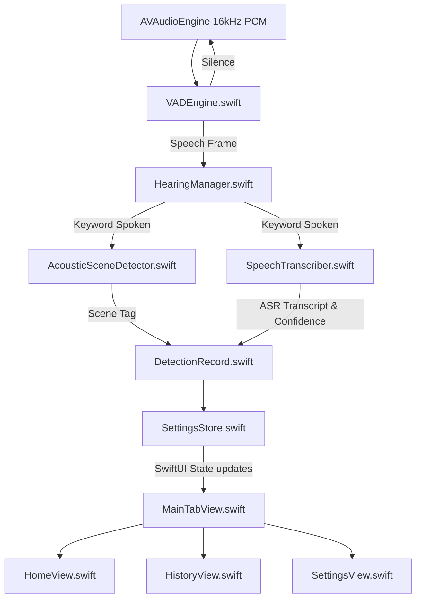

# Walkthrough: FocusAid Native SwiftUI Migration

FocusAid has been completely migrated from React Native to a high-performance, pure native Swift and SwiftUI iOS application. This native implementation provides direct access to iOS audio frameworks, eliminates JavaScript bridge latency, and offers a highly responsive, offline-first user experience.

---

## 1. System Architecture

The native application utilizes a modular services-and-views architecture for processing on-device audio in real-time.

---

## 2. Component Directory & File Index

### Core Architecture & App Life Cycle
- **[HearingTriggerApp.swift](file:///Users/sathyapriya/Desktop/React-Native/FocusAid/ios/FocusAid/HearingTriggerSwift/HearingTriggerApp.swift)**: The entry point setup with `@main` initiating the SwiftUI view hierarchy and managing initial notifications.
- **[AppDelegate.mm](file:///Users/sathyapriya/Desktop/React-Native/FocusAid/ios/FocusAid/AppDelegate.mm)**: Integrates the Objective-C entry hook required for linking and bridge setup.

### Core Services (Business Logic)
- **[VADEngine.swift](file:///Users/sathyapriya/Desktop/React-Native/FocusAid/ios/FocusAid/HearingTriggerSwift/Services/VADEngine.swift)**: Performs local energy-threshold voice activity detection to filter out ambient silence, saving CPU cycles before patterns are matched.
- **[HearingManager.swift](file:///Users/sathyapriya/Desktop/React-Native/FocusAid/ios/FocusAid/HearingTriggerSwift/Services/HearingManager.swift)**: Orchestrates `AVAudioEngine` capture, streams buffer buffers to VAD, scans PCM data frames for configured keyword signals, and coordinates background workers.
- **[SpeechTranscriber.swift](file:///Users/sathyapriya/Desktop/React-Native/FocusAid/ios/FocusAid/HearingTriggerSwift/Services/SpeechTranscriber.swift)**: Manages Apple's native, offline-capable `SFSpeechRecognizer` API to transcribe short audio buffers post-trigger.
- **[AcousticSceneDetector.swift](file:///Users/sathyapriya/Desktop/React-Native/FocusAid/ios/FocusAid/HearingTriggerSwift/Services/AcousticSceneDetector.swift)**: Leverages YAMNet via TensorFlow Lite (`TensorFlowLiteSwift` pod) to categorize the environment soundscape (e.g. Hall, Office, Restaurant, or Street).

### UI Screens & View Components
- **[MainTabView.swift](file:///Users/sathyapriya/Desktop/React-Native/FocusAid/ios/FocusAid/HearingTriggerSwift/UI/MainTabView.swift)**: Primary navigation hub containing tabs for Listen (Home), History, and Settings.
- **[HomeView.swift](file:///Users/sathyapriya/Desktop/React-Native/FocusAid/ios/FocusAid/HearingTriggerSwift/UI/HomeView.swift)**: The main listening dashboard featuring state toggles, status reports, and active scene tracking.
- **[HistoryView.swift](file:///Users/sathyapriya/Desktop/React-Native/FocusAid/ios/FocusAid/HearingTriggerSwift/UI/HistoryView.swift)**: A scrollable, reverse-chronological interface displaying past detections.
- **[SettingsView.swift](file:///Users/sathyapriya/Desktop/React-Native/FocusAid/ios/FocusAid/HearingTriggerSwift/UI/SettingsView.swift)**: Allows interactive configuration of keywords, sliders for confidence, and toggles for haptics.
- **[SplashScreenView.swift](file:///Users/sathyapriya/Desktop/React-Native/FocusAid/ios/FocusAid/HearingTriggerSwift/UI/SplashScreenView.swift)**: Premium branded native launch view animation.
- **[PermissionGateView.swift](file:///Users/sathyapriya/Desktop/React-Native/FocusAid/ios/FocusAid/HearingTriggerSwift/UI/PermissionGateView.swift)**: Interactive walkthrough requesting Microphone and Speech Recognition permissions.
- **[PulseRingView.swift](file:///Users/sathyapriya/Desktop/React-Native/FocusAid/ios/FocusAid/HearingTriggerSwift/UI/Components/PulseRingView.swift)**: Custom SwiftUI pulse animation surrounding the microphone badge when active.
- **[DetectionCardView.swift](file:///Users/sathyapriya/Desktop/React-Native/FocusAid/ios/FocusAid/HearingTriggerSwift/UI/Components/DetectionCardView.swift)**: Sub-card presenting transcripts, timestamp metadata, confidence tags, and scene labels.

---

## 3. UI Overview & Layouts

Below is the visual overview of the live listening dashboard state:

### Active Listening State

*Active UI showing real-time scene classification (Office, Hall, etc.) alongside pulsed mic ring animation and recent detections.*

### Mic Inactive State

*Idle dashboard indicating audio processing is paused.*

---

## 4. Setup & Verification

Build settings have been updated to target Apple platforms natively via CocoaPods:

1. **CocoaPods Dependency Manager**:
   Verified and configured using the local [Podfile](file:///Users/sathyapriya/Desktop/React-Native/FocusAid/ios/Podfile) targeting static pods including:
   - `TensorFlowLiteSwift (~> 2.14.0)`
2. **Project Files**:
   Linked and verified inside [FocusAid.xcworkspace](file:///Users/sathyapriya/Desktop/React-Native/FocusAid/ios/FocusAid.xcworkspace).
